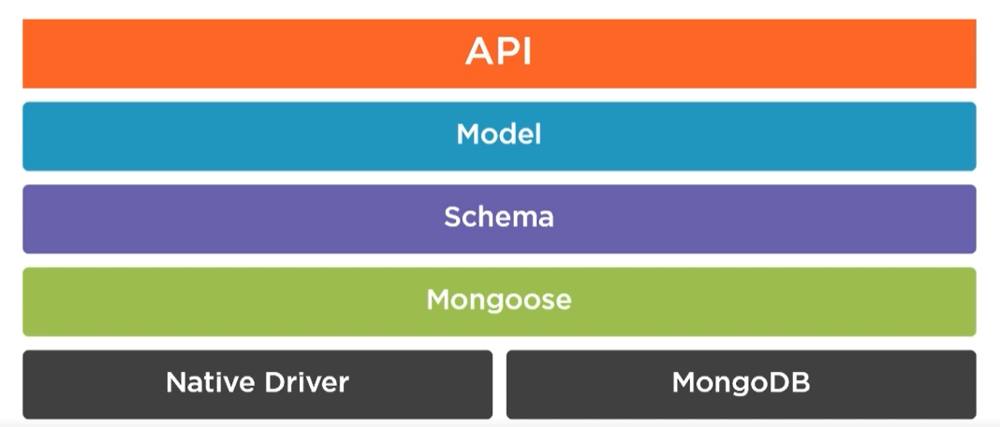
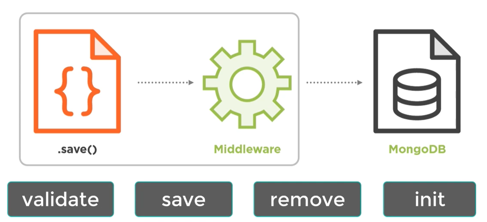

# Notes

## Online Trainings

### 1. Pluralsight - Querying Data from MongoDB

BSON - MongoDB represents JSON documents in binary form called BSON internally. It enriches JSON with additional data types that Mongo uses like Object Id, date, etc.

Mongo DB is schemaless. Mongo does not enforces a schema, but documents inside the same collection should have a similar structure for consistency.

```shell
mongo "localhost:27017"
db
show dbs
use db_name
show collections
```

```shell
db.aircraft.count()
db.aircraft.find()
it
db.aircraft.pretty()
```

Mongo GUI - Mongo Compass, Robo 3T

The find() method returns a cursor to the documents that match the query criteria. In projection, 1 means inclusion and 0 for exclusion.

```shell
db.aircraft.find({}, {model: 1, range:1, _id: 0})
```

Cursor - A virtual object where MongoDB stores the documents returned by the find method. It can have any methods like below -

```shell
db.aircraft.find().pretty()
db.aircraft.find().count()
db.aircraft.find().skip(3)
db.aircraft.find().limit(5)
db.aircraft.find().sort({model: 1})
```

Mongo DB does not guarantee the order of the returned documents unless sort() method is used. 1 for the ascending order and -1 for descending order.

The find() method returns a cursor, however the findOne() method returns a actual document. If no document match the criteria, the method returns null.

Best Practice - We should pass an empty object to find() method when we want to return all the documents instead of using blank find() method -

```shell
db.aircraft.find({})
```

Comparison query operations - $eq, $ne, $in, $nin, $lt, $lte, $gt, $gte

```shell
db.aircraft.find({model: 'Boeing'})
db.aircraft.findOne({model: 'Boeing'})
db.aircraft.findOne({model: {$ne: 'Boeing'}})
db.aircraft.findOne({model: {$in: ['Boeing', 'Airbus]}})
db.aircraft.findOne({model: {$in: [/^A/]}}) // using regular expression
```

Geo Spatial data types - GeoJSON, Legacy
Geospatial queries - $near - filters documents where a location field is between a min and max value in meters from a specified geometry.
Logical Query Operators - $and and $or.

```shell
db.aircraft.find({$and:[{capacity: 124}, {range: {$gt: 6000}}]})
db.aircraft.find({range: {$lt: 600, $gt: 6000}}) // short-hand syntax if same field
```

Nested document query -

```shell
db.crew.find({"address.city": "berlin"})
```

Querying null or missing fields, and field types -

```shell
db.crew.find({address: null}).pretty();
db.crew.find({address: {$exists: false}}).pretty();
db.crew.find({address: {$type: "object"}}).pretty();
```

BSON types - double, string, object, array, boolean, date, 64-bit integer
Free text search - the Text index support fast text searches on strings and arrays of strings fields. We can not perform free text searches without a text index.

```shell
db.crew.createIndex({name: "text", skills: "text"})
db.crew.find({$text: {$search: "technical Anna"}})
```

Sorting by relevance - we can aggregate results by score using the $meta projection operator.

```shell
db.crew.find({$text: {$search: "technical Anna"}}, {score: {$meta: "textScore"}}).sort({score: {$meta: "textScore"}})
```

Array query operators - $all, $size, $elemMatch

```shell
db.crew.find({skills: {$all: ["technical", "sales"]}}) // order does not matter
db.crew.find({skills: {$size: 2}}) // which have skills array size as 2
db.crew.find({skills: {$elemMatch: {name: "flying", lvl: {$gt: 7}}}}) // supports multiple conditions
```

Array projection operators - use to determine which elements of an array should be returned or hidden from a query. Operators - $slice, $, $elemMatch

```shell
db.crew.find({}, {skills: {$slice: 1}})
db.crew.find({}, {skills: {$slice: [1,1]}}) // skip n element and pick m element
db.crew.find({skills: "management"}, {skills.$: 1}) // show first element that matches an array query
db.crew.find({}, {skills: {$elemMatch: {lvl: {$gt: 7}}}}) // display only the first element to match the projection condition
```

### 2. Pluralsight - Foundations of Document Databases with MongoDB

NoSQL - Not Only SQL
CAP Theoram - consistency, availability, partition tolerance (system won't fail). MongoDB supports consistency and partition tolerance.
Types of NoSQL databases - relational database, document database, key-value databases (Redis DB), white-column stores (Cassandra DB), Graph Database
MongoDB is a document database.
Why use MongoDB - open source, document database, high performance, rich query language, high availability, horizon scalability.
JSON is a UTF-8 String but BSON is a Binary. JSON is human and machine readable but BSON is a machine readable only.
Create operation - if the collection does not currently exist, insert operation will create the collection.

```shell
db.createCollection("collection_name")
db.newUsers.insertOne({name: "dummy user", email: "dummy@abc.com})
db.newUsers.insertMany([{name: "dummy user", email: "dummy@abc.com}, {name: "dummy2 user", email: "dummy2@abc.com}])
db.newUsers.find({})
```

Read Concern for find() operator - allows to control the consistency and isolation properties of the data read from replicate sets and replica set shards. Types - Local, Available, Majority (default), Linearizable, Snapshot.
Write concern - level of acknowledgement requested from MongoDB for write operations. Types - w:1 (Ack from primary), w:0 (No ack), w:n (primary + (n-1) secondary), w: (majority), wtimeout (time limit to prevent write operations from blocking indefinitely)
We can not replace the \_id value with another value.
$set creates field if not already existing.
By using upsert as true, if no document matches the query to update, then new document will be inserted.

```shell
db.collection.updateOne({title: {$eq: "ABC"}}, {$set: {title: "XYZ"}})
db.collection.updateMany({year: {$eq: 1988}}, {$set: {"year": "2025"}}, {upsert: true}) // if no match found, then insert 1988 and then update it with 2025
db.collection.replaceOne({runtime: {$eq: 1122}, {runtime: 1122, title: "no title"}}) // replace whole document unlike just the mentioned fields
db.collection.deleteOne({runtime: 25})
db.collection.deleteMany({runtime: 25})
db.collection.remove({}) // remove entire documents form the collection
db.collection.remove({runtime: 35},
true) // remove first matched document, if we do not pass true then all matched document will be removed
```

MongoDB is a case-sensitive language. It supports MongoDB query language (MQL). It has dynamic JSON based schema unlike predefined in MySQL. It has no foreign keys or joins or triggers. It follows CAP theorem not ACID properties. It is horizontal scalable unlike SQL which have vertical scalable.
Use $lookup operator to get documents from other collection.
Creating index -

```shell
db.collection.createIndex({name: 1, age: -1}) // 1 for ascending
```

Which is best database - is your data structured or unstructured? preferred scalability strategy? No need for ORM (object relational mappings) with MongoDB.

### 3. Pluralsight - Introduction to MongoDB 2

There is no schema enforcement from MongoDB, it is a application responsibility.
Replicate sets - Minimum replica sets in MongoDB - primary db (only writable instance), secondary db (read-only instances, data is replicated from primary db) and arbiter db (no data, provides additional vote to elect the db in-case if primary gets failed).
By using the BSON and memory mapped files concept to store the data, makes the MongoDB very fast and efficient.
The \_id can contains any type of data except array.
The ObjectId() will return a new object id and it also contains a timestamp ObjectId().getTimestamp() in ISODate format. We can use it for sorting in created by format.
Operators - $set, $unset, $rename, $push, $pull, $pop
MongoDB uses a cursor to support the efficient retrieval of the document as documents might be in huge number which might support the memory to load. By this, it will give you a batch of documents and close the connection.
We can use index to speed up the queries. The scanning of each location on the disk is bad for performance which finding a record, the solution is to use an index, it basically holds mapping to those locations from field values. By this, we can jump directly to the disk location where document is stored is good for performance and less i/o operations. It also good for sorting performance purpose as-well. Without index it will show n number of objects has been scanned, after index it will show 1 number od object has been scanned. Index on the \_id field can not be dropped.
Index types - Regular (B-tree), Geo (sort nearby locations), Text, Hashed, TTL (expiration date for documents)

```shell
db.foo.ensureIndex(keys, options)
db.system.indexes.find({ns: 'test.animals'}, {key:1}) // to find if index exists
db.animals.dropIndex("name_1")
```

To know about how MongoDB will find the document, we can use explain() method -

```shell
db.animals.find({name: 'cat}).explain()
```

Covering index - we use query using index and all the information is with index itself then there is no need to go to the dist to get the actual document, we can use the index itself to the actual result. In the explain() it will say indexOnly as true. Suppose we have applied index on name field and returning only the name field, not even \_id, then the covering index will be used.
When our database is large, we can create index in the background so that read and write action won't get blocked.

```shell
db.animals.ensureIndex({tags: 1}, {background: true})
```

We can also create Unique index type, \_id is already have a unique index. It won't allow to insert the same value in the document.

### 4. Pluralsight - Code School: The Magical Marvels of MongoDB

MongoDB is great for unstructured data, specially when we have lot of it. It was created by 10gen in 2007 and in 2013, they renamed itself as MongoDB. The Mongo name came from word 'Humongous'.

The document size should be less than 16 MB, otherwise, it will throw an error while inserting.

Operators - $inc, $unset, $rename, $max, $min, $mul

Positional operator ($) - It is a placeholder that will set the proper position for the value specified in the query parameter.

If data is frequently used together then we should use the embedding approach while data that's rarely used can afford the cost of referencing. Also, if data is changing frequently then we can use reference approach to prevent inconsistencies from duplication.


The aggregate API provides advanced computations like $group. When values begin with a $ like $vendor_id, they represents field paths that point to the value.

```typescript
db.potions.aggregate([
  { $group: { _id: '$vendor_id', total: { $sum: 1 }, grade_total: { $sum: '$grade' } } }
]);
```

### 5. Pluralsight - Modifying Data in MongoDB 4

The ObjectId - The first 4 byte contains timestamp, next 5 byte contains random value and then next 3 byte has a incrementing number. By this way, the value won't be duplicated even in multiple server. The value is represented as a 24 digit hexadecimal string.

Write concern -

- `w` - The number of instances the operation has propagated to
- `j` - Whether the operation wrote to disk or memory
- `wtimeout` - Duration to wait for operation to complete

Bulk write operations - They allow us to perform combination of write operation with a single method call. Bulk write are different from Bulk imports.

```typescript
db.conferences.bulkWrite([
  { insertOne: { document: { title: 'MongoDB Conf' } } },
  { deleteOne: { filter: { _id: 10 } } }
]);
```

### 6. Pluralsight - Moving Forward with Mongoose.js

### 7. Pluralsight - Fundamentals of Mongoose for Node and MongoDB

Mongoose is like a filling cabinet full of documents but one that has some rules and structure to it. It provides a straight-forward, schema-based solution to model application data. It includes built-in type casting, validation, query building, business logic hooks and more, out of the box.

Abstraction Layer -



To init the eslint file use below command -

```shell
node ./node_modules/eslint/bin/eslint.js --init
```

Everything in Mongoose starts with a Schema. Models are built from Schema -

```typescript
const mongoose = require('mongoose');

const addressSchema = new mongoose.Schema({
  type: { type: String },
  street: String
});

const customerSchema = new mongoose.Schema({
  name: {
    first: { type: String, required: true, message: 'first name is required' },
    last: String
  },
  address: [addressSchema],
  createdOn: { type: Date, default: Date.now },
  isActive: { type: Boolean, default: true }
});

export const Customer = mongoose.model('Customer', userSchema);
```

Methods available on Model - find, findOne, findById, where, updateOne, updateMany, deleteOne, deleteMany, findByIdAndUpdate, findByIdAndDelete

```typescript
Customer.where('discount')
  .gte(10)
  .lt(20)
  .exec(function (err, results) {
    if (err) throw err;
    console.log(results);
  });

Customer.updateOne({ memberName: 'Marry' }, { memberName: 'Mary' }, function (err, results) {
  if (err) throw err;
  console.log(results);
});
```

Built-in validators - enum, match, minlength, maxlength , min, max. We can also create custom validators. We can also use custom error message templates like {PATH}, {VALUE}, {TYPE}, {MIN}, {MAX}

Middlewares are functions which are given control over the execution flow for the following methods: validate, save, remove and init. Like middleware comes into a picture while calling .save() method on model between .save() method and MongoDB.



### 8. Pluralsight - Moving Forward with Mongoose.js

We can set schema as strict to `false` to save data even if it contains additional properties.

Along with the document middleware, we now also have query middleware with methods like count, find, findOne, update, insertMany, findOneAndUpdate, findOneAndRemove

Extending functionalities with plugins - We can either create custom plugins like for pre-hooks or publicly available like mongoose-times. For plugin library we can check the <https://www.plugins.mongoosejs.io> website.

```typescript
var timestamps = require('mongoose-times');
itemSchema.plugin(timestamps);
```

Document middleware provides init(), validate(), save() and remove() with pre/post hooks for before and after saving the document into MongoDB.

```typescript
schema.pre('save', function (next) {
  this.state = this.state.toUpperCase();
  next();
});

schema.pre('find', function () {
  this.where('estimateValue').gt(0);
});
```

Error handling middleware -

```typescript
schema.post('save', function (error, doc, next) {
  if (error.name === 'MongoError' && error.code === 11000) {
    next(new Error('There was a duplicate key error'));
  } else {
    next(error);
  }
});
```

By using Discriminators, we can extend our base schema so that we can have overlapping schema definition on top of a single MongoDB collection. It gives us an ability to store different details for diffrent documents within the same collection.

```typescript
var specialItemSchema = mongoose.Schema({
  hazardCode: String
});

export var SpecialItem = BaseItem.Discriminator('SpecialItem', specialItemSchema);
```

A promise represents the eventual result of an asynchronous operation. Mongoose uses mpromise library by default. We can also tell mongoose to use a different promise library like bluebird or q.
