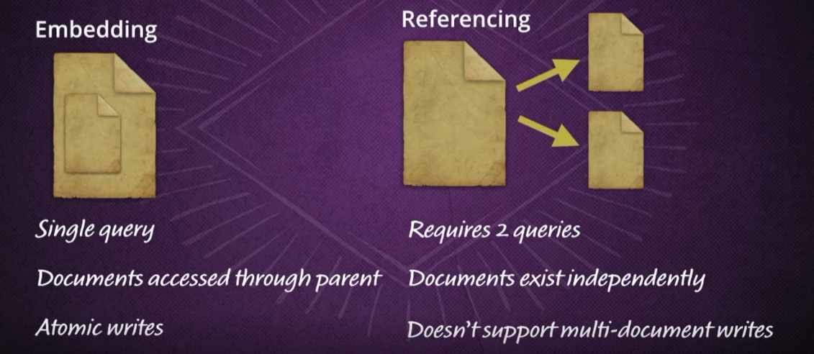

# Notes

## Online Trainings

### 1. Pluralsight - Code School: The Magical Marvels of MongoDB

MongoDB is great for unstructured data, specially when we have lot of it. It was created by 10gen in 2007 and in 2013, they renamed itself as MongoDB. The Mongo name came from word 'Humongous'.

The document size should be less than 16 MB, otherwise, it will throw an error while inserting.

Operators - $inc, $unset, $rename, $max, $min, $mul

Positional operator ($) - It is a placeholder that will set the proper position for the value specified in the query parameter.

If data is frequently used together then we should use the embedding approach while data that's rarely used can afford the cost of referencing. Also, if data is changing frequently then we can use reference approach to prevent inconsistencies from duplication.



The aggregate API provides advanced computations like $group. When values begin with a $ like $vendor_id, they represents field paths that point to the value.

```typescript
db.potions.aggregate([
  { $group: { _id: '$vendor_id', total: { $sum: 1 }, grade_total: { $sum: '$grade' } } }
]);
```

### 2. Pluralsight - Modifying Data in MongoDB 4

The ObjectId - The first 4 byte contains timestamp, next 5 byte contains random value and then next 3 byte has a incrementing number. By this way, the value won't be duplicated even in multiple server. The value is represented as a 24 digit hexadecimal string.

Write concern -

- `w` - The number of instances the operation has propagated to
- `j` - Whether the operation wrote to disk or memory
- `wtimeout` - Duration to wait for operation to complete

Bulk write operations - They allow us to perform combination of write operation with a single method call. Bulk write are different from Bulk imports.

```typescript
db.conferences.bulkWrite([
  { insertOne: { document: { title: 'MongoDB Conf' } } },
  { deleteOne: { filter: { _id: 10 } } }
]);
```

### 3. Pluralsight - Moving Forward with Mongoose.js

### 4. Pluralsight - Fundamentals of Mongoose for Node and MongoDB

Mongoose is like a filling cabinet full of documents but one that has some rules and structure to it. It provides a straight-forward, schema-based solution to model application data. It includes built-in type casting, validation, query building, business logic hooks and more, out of the box.

Abstraction Layer -


